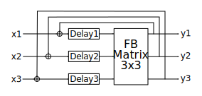
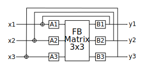

Background
-----------

A feedback delay network (FDN) has usually a bunch of parallel delaylines with feedback between 
every pair of them mediated by a feedback matrix. See the diagram below:

This depicts a barebones FDN with 3 delaylines and a corresponding 3x3 feedback matrix. It's 
actually even a somewhat simplified depiction. In order to not clutter the diagram too much, I did 
not include the means to produce the 3 inputs x1,x2,x3 from monophonic or stereophonic input to the
whole effect. Neither did I include the means to mix down the 3 outputs to mono or stereo. For 
stereo inputs and outputs, the former could be done by means of a 3x2 input matrix and the latter 
by a 2x3 output matrix. It is also possible to pick up y1,y2,y3 directly after the delaylines 
rather than after the matrix. That might actually even be better because it allows for more easy 
adjustment of the pattern of the early reflections. 

Moreover, in a practical implementation, one would have to include damping factors and even damping 
filters in the feedback paths. The factors could be thought of as being absorbed into the matrix, 
though. But it's usually more convenient to leave the matrix unitary and do the scaling of the 
feedback signals explicitly before or after the matrix. When we include damping, we could place the
damping filters (typically lowpass- or (attenuating) high-shelving filters) directly after the 
delaylines or after the feedback matrix. If we put the damping filters directly after the 
delaylines and want to pick up the y1,y2,y3 signals after the delaylines, too, then it may make 
sense to pick them up in between the delays and the dampers such that the first reflections are 
undamped. Or maybe it's actually desirable to already dampen the first reflections. That's actually
more physically plausible. In that case, they should be picked up after the dampers.

The delays are usually chosen to be pairwise mutually prime. That avoids repetitive patterns in 
the impulse response as much as possible. In other words, the length of the inevitable periodicity 
is maximized (verify!).

The Idea
--------

My new idea is now to introduce a second set of delaylines after the matrix but before picking up 
the feedback signals. The new structure would look like depicted below:

I also renamed the Delay1 etc. labels to A1,A2,A3 to indicate that this may not just be a delay but
 rather a more general transfer function A(z). It may be a simple delay but it may also be an 
 allpass, a notchpass and it may or may not have the damping already baked in. The new delays (or 
 more general filters) after the matrix are denoted by B1,B2,B3. These should also be thought of as 
 transfer functions B1(z) etc.

Note how this increases the number of feedback paths with different lengths from 3 to 3*3 = 9. If 
we denote by M1,M2,M3 the delays in A1,A2,A3 and by N1,N2,N3 the delays in B1,B2,B3 then the delays 
that occur in feedback paths are M1+N1, M1+N2, M1+N3, M2+N1, M2+N2, M2+N3, M3+N1, M3+N2, M3+N3. That 
is: We get all the possible sums Mi+Mj where i,j = 1,2,3. Now we want these 9 numbers to be mutally prime.  ...TBC...

ToDo
----

- Write down the transfer functions of the regular 3x3 network and the modified one with the extra
  delays to figure out if these really give us anything new or if we could achieve the same effect
  with the old structure.

- We could also interpret the new structure as dragging the matrix "into" the delay block. We break
  up the delayline block into left and right half and put the matrix in between. It now acts like
  a scattering matrix between the left and right part of the delay block.

- Explain where the damping occurs in the new structure. I think, it makes most sense to imagine 
  damping baked into A1,A2,A3 as well as B1,B2,B3. But the question arises, how we distribute the
  damping between the A and B filters. An impulse signal that circled around the loop as 
  A1 -> FB -> B3 would already have two rounds of damping applied. One from the A1 filter and one 
  from the B3 filter. Maybe we need to adjust the (linear) high frequency gain of the dampers 
  (assuming high shelvers) by taking its square root? Try it!

- Try picking up output signals after the A filters *and* after the B filters. This should be 
  particularly good for the initial echo density because we will see early reflectios with all 9
  delay values.

- Try to find optimization algorithms for the delay times that search for assignments of the 6 
  delays M1,M2,M3,N1,N2,N3 such that all 9 sums are mutually prime. The 3x3 case is just a toy
  example though. In reality, we may want to do that for the 16x16 case or so. The algorithm should 
  perhaps start with an initial setting and then check some (random?) variations of that setting. 
  In the 16x16 case, there are 256 sums and we try to find 32 delay values such that all possible
  pairwise sums are mutually prime. Maybe number theory can help with that search? Are there any
  theorems for when a sum of two numbers is a prime, for example? Maybe that helps to narrow the 
  search space. Or maybe use fractional delays (with 1st order allpass interpolation) and try to 
  define some (differentiable) cost function that measures the irrationality of all the possible
  delay ratios. Maybe this cost function should be fomulated in terms of the continuous fraction
  expansions of the ratios? By the ratios, I mean numbers like (M1+N1)/(M1+N2), ... i.e. the 
  ratios between all possible sums (except those with same numerator and denominator like 
  (M1+N1)/(M1+N1) and those where numerator and denominator are just a swap of another ratio. 
  If we already have (M1+N1)/(M1+N2), we don't need (M1+N2)/(M1+N1) anymore. I think, we should
  get (N+1)*N/2 - N different ratios (number of elements of a triangular matrix minus number of 
  diagonal elements)).

- Maybe try to extend the idea to put another matrix after the B filters and after that matrix 
  another set of delays/filters (let's call them C), etc. This way, we could build a multilayer FDN
  in a way similar to multilayer perceptrons. The feedback would occur after the last layer. We 
  could call them MLFDNs. In this view, the architecture above could perhaps be considered to have 
  1.5 layers. Or maybe define the number of layers as the number of delay sets. The number of 
  matrices is always 1 less - except for the 1 layer case, maybe. Or maybe call it scattering 
  feedback delay network. Or delay-scatter-feedback network.